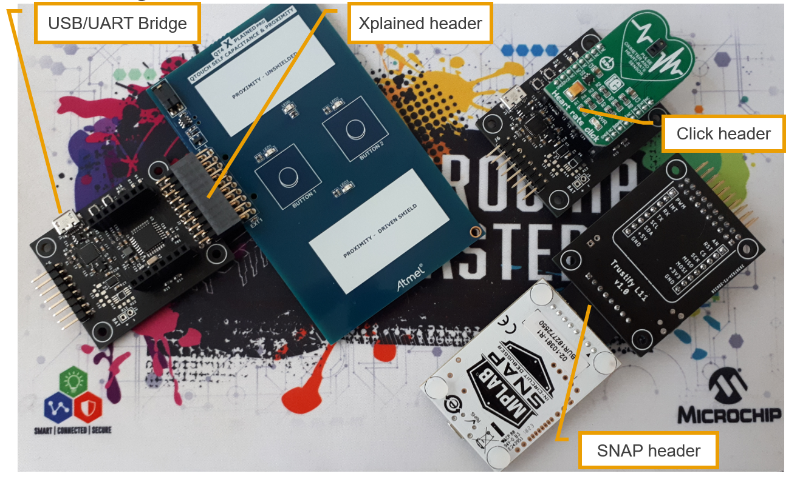

**Trustify** - [Link](https://)
====================================================

**Story**
------------------------
Makers develop a secure board during COVID-19 period to support communities and device manufacturers on rethinking security strategies for their future product roadmap. People know how to protect their lives against COVID virus, we show you how to protect your digital assets, firmware, intellectual property, keys by design. 

  - *MCU*: SAML11 - CortexM23 with TrustZone Hypervisor 
  - *Secure Element*: JIL rated ATECC608A Trust & Go with pre-provisioned certificate chain, keys
  - *Programmer / Debugger*: Microchip low cost SNAP / PicKIT4
  - *Expansion Connectors*: Mikroelektronika Click / Microchip Xplained
  - *Interfaces*: FTDI USB to UART Bridge for debugging and powering the board

**Details**
------------------------

