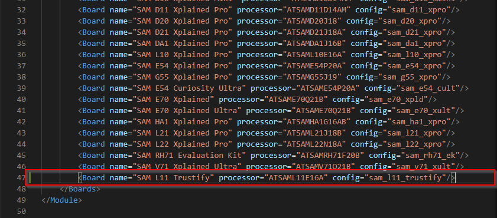
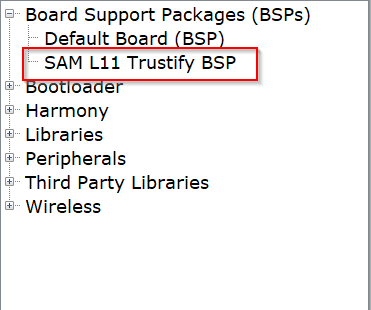
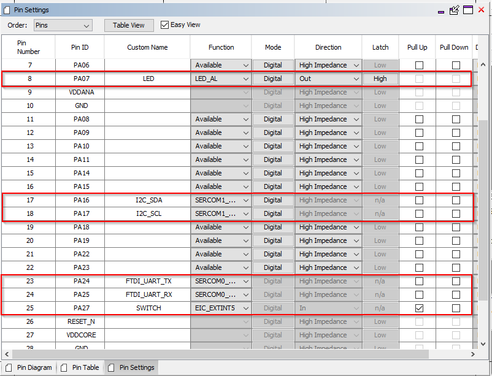
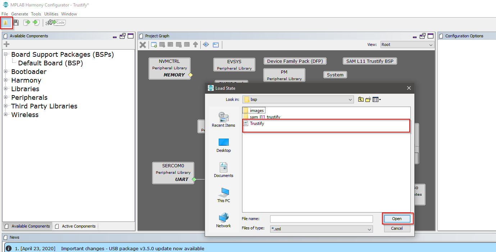
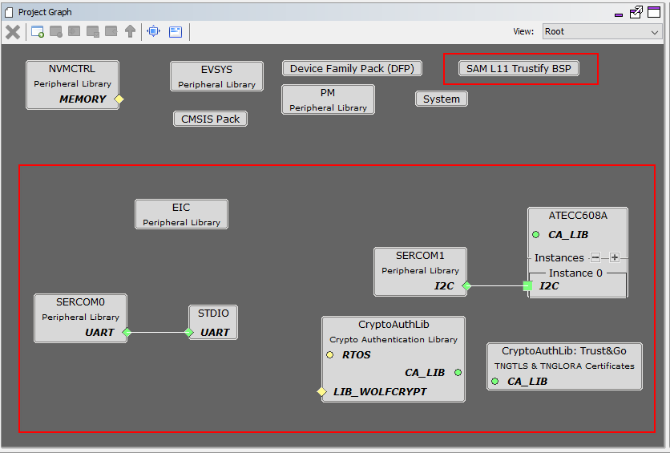

**Trustify** - [Link](https://)
====================================================

**Board Support Package and Configuration File**
------------------------

# Board support package (BSP)

To make life a bit easier, a BSP for Trustify board is prepared, which contains the information about the pinout of this board. The pinout file include:

* Switch
* Led
* TX and RX pin for UART
* SDA and SCL for I2C

To integrate thuis BSP into your project, please do the following things:

1. Copy the folder saml_11_trustify to this location: C:\PATH_TO_HARMONY\Harmony3\bsp\boards. Normally, it locates at C:\Users\user_name\Harmony3\bsp\boards

2. In the same location, open file module.xml file and add the following file at the end of the list of the board: 

```
<Board name="SAM L11 Trustify" processor="ATSAML11E16A" config="sam_l11_trustify"/>
```



3. In MHC3, you are able to add the Trustify board bsp: 



4. With the corresponding pinout:



# Configuration File

After adding the BSP file to your project, you can also add the default configuration for the Trustify board, which is initialized the following component:
* System tick to use delay function
* I2C to interface with ATECC608
* UART to send data to USB serial port
* External interrupt for the switch

To add the xml configuration file, please do the following steps:

1. Copy the Trustify.xml to your project.
2. In MHC3, choose:
   


3. You will get the following configuration



# The End