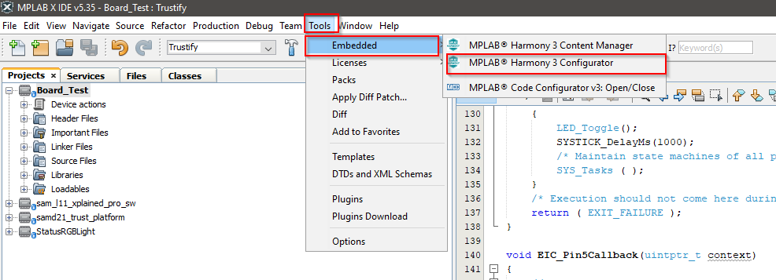
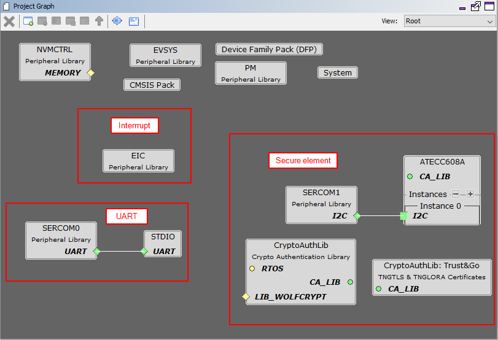
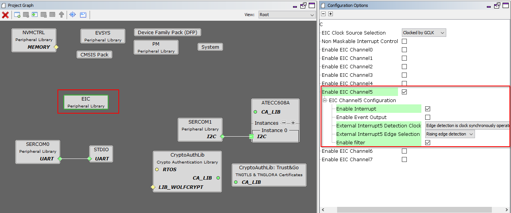
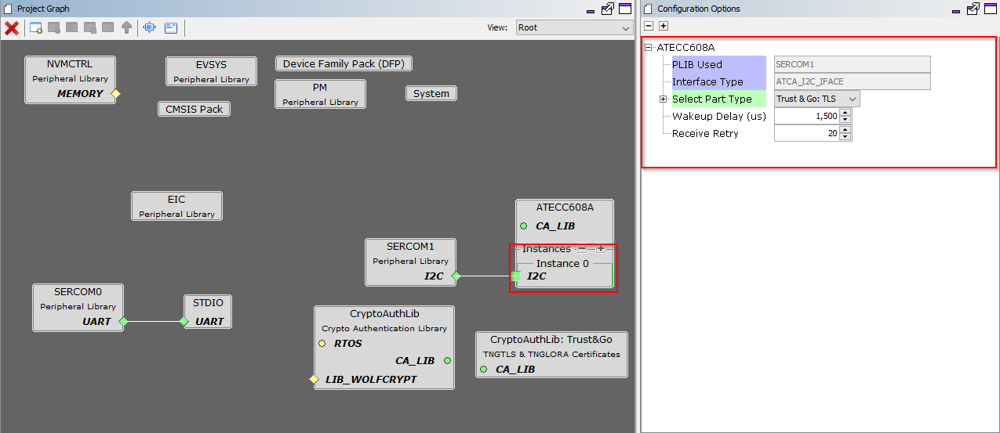
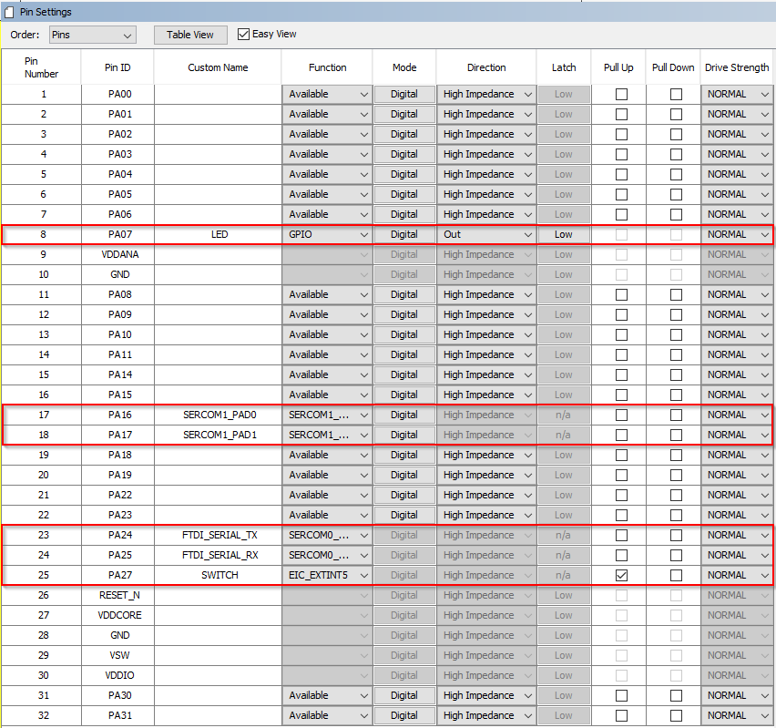
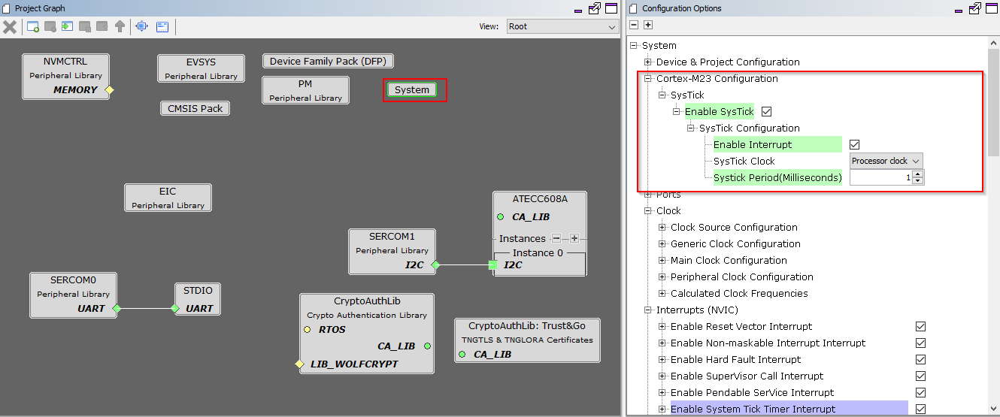
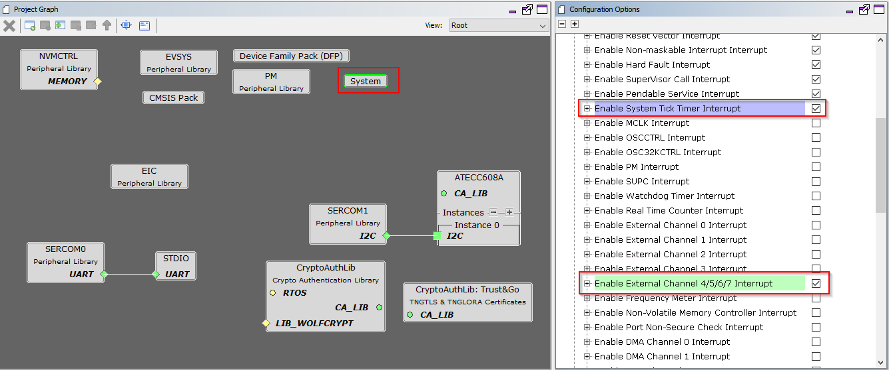

**Trustify** - [Link](https://)
====================================================

# Board Test example

## Introduction
This example is a short application to test the functionality of the board when you power it up for the first time. Additionally, it shows you how to initialize the on-board peripherals using MPLAB Harmony Configurator version 3.

## Prerequisite

### Software
* MPLAB X
* MPLAB Harmony Configurator version 3 (MHC v3)
* Terminal program (for example TeraTerm)
   
### Harware
* Trustify board
* MPLAB SNAP
* 2 micro USB cables

## Power-up the board for the first time

Connect the board as the following picture:

[place holder for picture](link)

Start MPLAB X and open this application

Compile and flash the application into the Trustify board

Start terminal program with the following configuration

* Baud: 115200
* Data: 8 bits
* Stop bits: 1 bit
* Parity: none 

Press the reset button on the board (SW1), you should see the following message on the terminal:

Press the user button (SW2), you should see the following message on the terminal

You can observe that the LED should blink every one second

## Harmony Configurator

As mention in the introduction section. The peripherals on the board, which are LED, button, and the secure element are not initalized from scratch but using a code generator tool called Microchip Harmony Configurator verion 3.

To activate the tool, in MPLAB, choose Tools --> Embedded --> MBLAB Harmony 3 Configurator  

After the MHC v3 is opened, you see a component diagram. From the diagram, there are 3 groups handling the interrupt, the UART and the secure element

The interrupt is configured as follow:

The UART is configured as follow:

The secure element is configured as follow:

The pinout for the Trustify board is following:

Last but not least, we have to activate the system tick, in order to use the delay function and the interrupt service routine:

## The End
