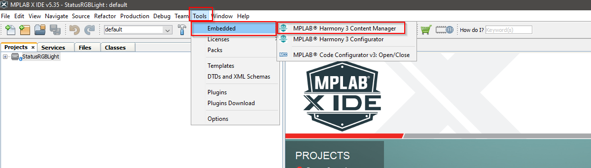
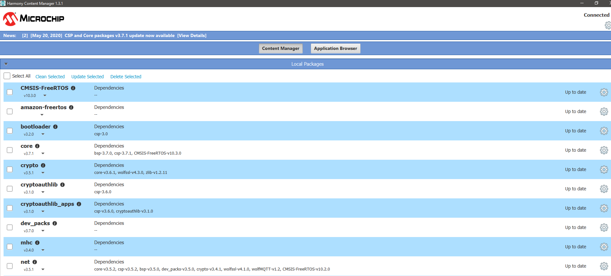

**Trustify** - [Link](https://)
====================================================

# Introduction

This folder contains the example code for the Trustify board. These example will help you to understand and work faster with the Trustify board.

It also shows you how to setup the toolchains to use those examples and to work with the Trustify board in general. 

# Example List

| Name  | Description |
| ------------- | ------------- |
| [Board Test](https://github.com/jpiwek/trustify/tree/master/software/examples/Board_Test)  | This example is a short application to test the functionality of the board when you power it up for the first time. Additionally, it shows you how to initialize the on-board peripherals using MPLAB Harmony Configurator version 3.  |
| [Trust_and_go](https://github.com/jpiwek/trustify/tree/master/software/examples/Trust_and_Go)  | This example shows you the methods and the procedure to read and to verify the TNG (trust and Go) certificate in the secure element.  |

# Toolchains setup

To use the example and also to work with the Trustify Board in general, we need the following tools:

* MPLAB X 
* XC32 compiler
* MPLAB Harmony Configurator version 3
* Terminal program of choice(TeraTerm will be used)

Those tools are free and will be described in the next step. 

## MPLAB X

MPLAB X is a free-of-charge IDE for programming 8-bit, 16-bit, and 32-bit microcnotroller from Microchip (Atmel products are included). Besides, it is included multiple plugin to support the IDE, for example: code configurator, serial port reader, RTOS monitor, etc. 

Please go [here](https://www.microchip.com/mplab/mplab-x-ide) to download and install the tool.

## XC32 compiler

After successfully installing the MPLAB X, you are prompted to install the compiler for the IDE. Please choose the XC32 compiler, download and install it.

Otherwise, you can manually download XC32 comipler [here](https://www.microchip.com/mplab/compilers). It is better to installing the compiler with the default path and option.

XC32 compiler supports all 32-bit PIC and SAM MCU/MPU.

## MPLAB Harmony Configurator version 3

MPLAB Harmony Configurator version 3 (MHC3) is a code generator tool, which is use to setup the peripherals and to generate the code out of the peripherals configuration. MHC3 also manages middlewares and software libraries from 3rd parties. All of the examples are based on MHC3 so installing it is a must. 

We will install HMC3 as a MPLAB X pluggin so please start the MPLAB X

Go to: Tool --> Pluggin Download --> Go to MPLAB X Pluggin Manager

Choose MPLAB Harmoniy Configurator 3 and click Install

After the installation process, we need to install the software package for MHC3. In the MPLAB X IDE, choose: Tool --> Embedded --> MPLAB Harmony 3 Content Manager

You will be asked to choose a location to store the software package

You are promted to choose which sofwtare packages. This is what I have choosen:

Choose and download the packages and you are ready to develop your first application for your Trustify board.

To know more about how to setup and running your first project, please refer [this example](https://github.com/jpiwek/trustify/tree/master/software/examples/Board_Test)

# The End