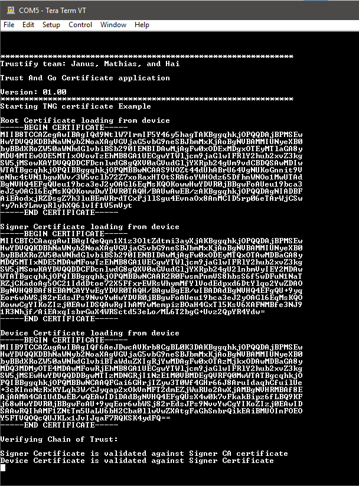
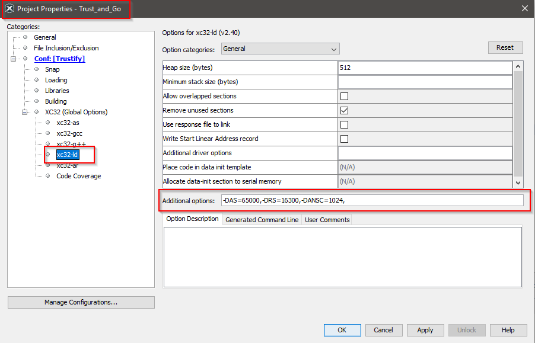

**Trustify** - [Link](https://)
====================================================

# TNG example

## Introduction
This example show you the methods and the procedure to read and to verify the TNG (trust and Go) certificate in the secure element. 

## Prerequisite

### Software
* MPLAB X
* MPLAB Harmony Configurator version 3 (MHC v3)
* Terminal program (for example TeraTerm)
   
### Harware
* Trustify board
* MPLAB SNAP
* 2 micro USB cables

## Running the example

1. Connect the board to your PC.

2. Start MPLAB X and open this application

3. Compile and flash the application into the Trustify board

4. Start terminal program with the following configuration

   * Baud: 115200
   * Data: 8 bits
   * Stop bits: 1 bit
   * Parity: none 

5. Press the reset button on the board (SW1), you should see the following message on the terminal:



## Note

If you are not familiar with the step, please refer [here]([link](https://github.com/jpiwek/trustify/tree/master/software/examples/Board_Test)) for setting up and running the board.

Trust zone is not fully supported in MHC3 so we have to modify the memory layout of the application manually. In the example projects, the memory layout is already set up for you. If you start a new project from sratch please add the follwing command:

```
-DAS=65000,-DRS=16300,-DANSC=1024,
```

to the linker script here:



## The End